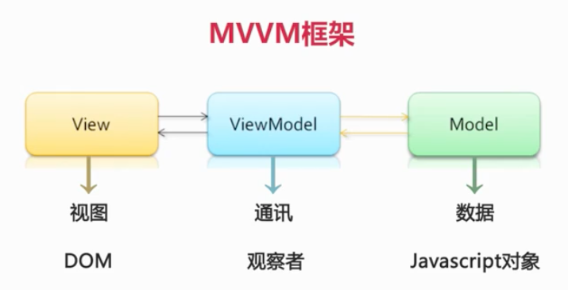
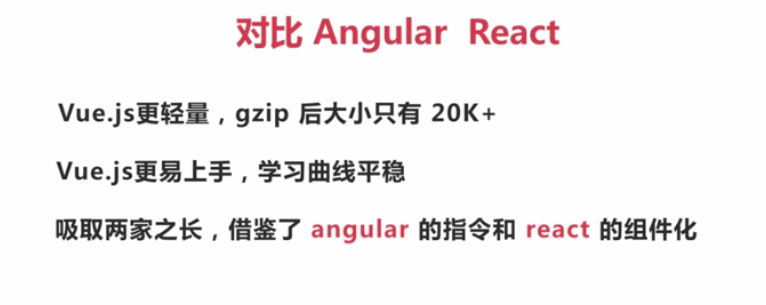
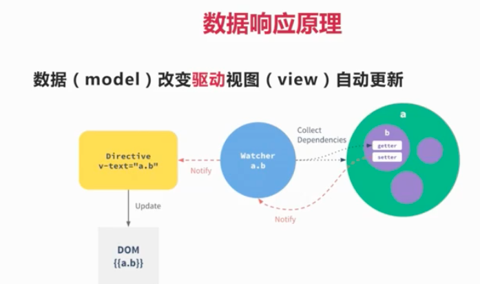
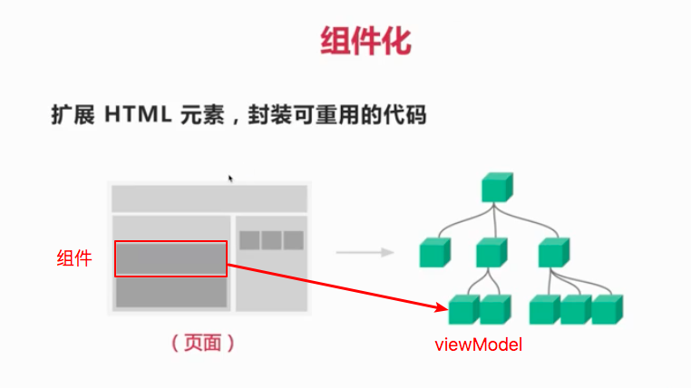
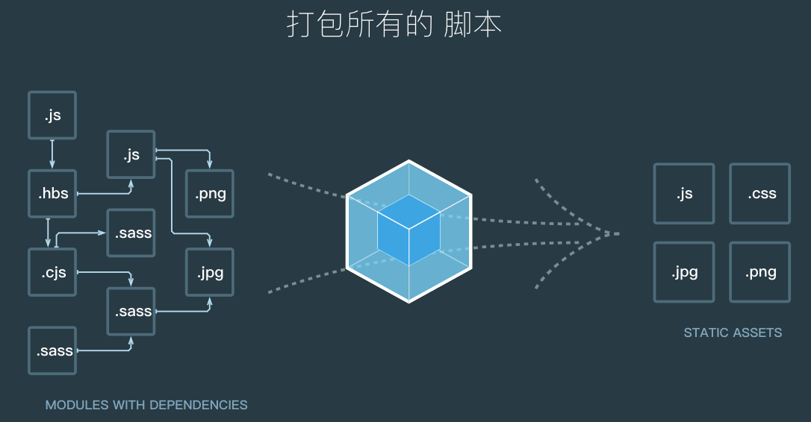

# Vue和Element实战

## 课程介绍

## 第二章 Vue.Js介绍
### 2.1 MVVM框架
Model ViewModel View


著名的MVVM框架包括
- Angular.js
- react.js
- vue.js

### 2.2 什么是Vue.js
- 一个轻量级MVVM框架
- 数据驱动+组件化的前端开发

### 2.3 与其他MVVM框架对比


### 2.4 Vue.js核心思想

#### 2.4.1 数据驱动


#### 2.4.2 组件化


组件设计原则
- 页面上每个独立的可视/可交互的区域视为一个组件
- 每个组件对应于一个工程目录，组件所需的各种资源在这个目录下就近维护
- 页面不过是组件的容器，组件可以嵌套自由组合形成完整的页面

## 第三章 Vue-cli开始Vue项目(Sell)
### 3.1 Vue-cli
Vue-cli是Vue的脚手架工具。Vue-cli帮助搞定以下内容:
- 目录结构
- 本地调试
- 代码部署
- 热加载
- 单元测试

### 3.2 Vue-cli 安装
- 先安装node.js
- sudo npm install -g vue-cli
- 使用vue命令创建外卖项目: vue init webpack sell
- 安装依赖：cnpm install。运行完后，会生成node_modules文件夹
- dev环境下运行: cnpm run dev
- 打包：cnpm run build

### 3.3 项目文件介绍
- build／config目录: webpack配置相关
- node_modules: 通过npm install安装的依赖代码库
- src: 存放开发源码
- static: 存放第三方静态资源。其中.gitkeep是为了当这个目录为空，也可以在git代码仓库中找到该文件夹
- .babelrc: 通常项目都是ES6，但是浏览器不支持ES6，该文件负责将编译后文件转换为ES5
- .editorconfig: 编辑器的一些配置
- .eslintignore: 忽略语法检查的目录文件
- .eslintrc.js: eslint的配置文件
- .index.html: 项目入口文件。在项目通过webpack编译期间，会自动插入到这个文件中
- package.json: 描述项目的配置文件

### 3.4 项目运行
- 项目的入口文件是index.html，编译过程中，会自动插入到index.html中
- 页面入口js，是src/main.js
- 每个组件（如App.vue)，分为三个模块：template（模板）、script（逻辑）和style（样式)。其中script中export default {}将组件导出成对象，供外面的调用

#### 3.5 webpack打包
webpack目前是前端最火的构建工具。视屏中基本讲述了webpack工作方式和很多帮忙理解的地方，这要涉及的目录是: build/config


## 第四章 项目实战-准备工作
### 4.1 需求分析
- 商家页
- 商品详情页

### 4.2 素材
素材存放在resource目录下

### 4.3 图标字体文件的制作
SVG是单一颜色的文件，放大伸缩不会变形，但通常不会直接使用，而是转成图标字体文件使用

- 使用IcoMoon的工具，[主页地址](https://icomoon.io/)

### 4.4 项目目录设计

- main.js 是项目入口js文件
- App.vue 整个Vue的大组件
- components目录 存放组件文件。建议先建目录，然后创建vue文件，因为vue初了.vue文件外，还会包含一些相关图片等等，建议相关放在一个目录下，资源就近维护
- common主动创建的目录，存放公共模块和资源。一般包括三个子目录: js、styles和fonts
- 删除assets目录，不需要

### 4.5 mock后端数据
提供出data.json文件

- seller : 商家相关的数据
- goods : 商品相关的数据
- ratings : 评论相关的数据

本节视频内容稍有不兼容，可通过[网址](https://www.xiuyuan.info/?p=230)来完成

## 第五章 项目实战-页面骨架开发

### 5.1 组件拆分（上）
- main.js是项目入口JS
- /* eslint-disable no-new */，不是注释，为了屏蔽下面一个new 关键字无需赋值

### 5.2 组件拆分（中）

#### 5.2.1 引入其他的vue
- 第一步：创建vue，如header.vue
- 第二步：标签script标签中添加export default {}
- 第三步：在待加的vue文件中script标签中import，并export default {}
- 第四步：在待加的vue文件中template标签中使用

### 5.3 组件拆分（下）

#### 5.3.1 安装依赖
- 安装依赖包，如stylus-loader，先在package.json中加入，然后调用cnpm install安装
- 查看node_modules目录下是否安装成功，即可

#### 5.3.2 所有内部依赖组件命名
引入其他的vue组件时

#### 5.3.3 Flex布局
- 在写页面三等分：商品、评价、商家，用到移动端经典Flex布局，Flex 布局成为布局的首选方案。可参考文档[Flex 布局教程：语法篇](http://www.ruanyifeng.com/blog/2015/07/flex-grammar.html)
- 写样式时，建议依样式层级依次写
- 属性是id，用‘#’; 属性是class，用'.'

### 5.4 Vue-router（上）
- vue-router建议使用npm安装
- 使用参考[官方文档](https://router.vuejs.org/zh/guide/#html)
- router-view用于当路由地址变化时，将刷新该模块

### 5.5 Vue-router (下)
- 建议import 导入使用'@'来描述路径，其中'@'在build/webpack.base.conf.js中定义的alias中描述

#### 5.5.1 Vue-router默认展示
- 进入首页，未展示出第一个页面，使用router.push('/goods')，告知默认展示
- 添加css样式。 & 表示其父元素，即tab-view的样式
- display:block是让元素为一个整体
- text-decoration: none; 去掉字体的下划线，将将其加入static/css/reset.css中整体有效

#### 5.5.2 CSS 书写规范
- 1. 布局样式先写，如display
- 2. 宽高，一些触发页面重绘的一些不可继承的随后写，如width、height
- 3. 最后设置些字体颜色一些可被继承的写在最后，如font-size、color

#### 5.5.3 点选中后，样式高亮
- vue-router在具体某个后，绘默认填充router-link-active。我们可以在创建VueRouter是重新命名为active
- 然后&.active 定义为 color: rgb(240, 20, 20)

### 5.6 像素border实现

#### 5.6.1 PC端使用border-bottom
- border-bottom是设置下边框，通过配置css：border-bottom : 1px solid rgba(7, 27, 17, 0.1)
- 手机端这种不行，因为会缩放

#### 5.6.2 手机端看样式
- 访问路径换成具体IP，不要使用localhost
- 页面上通过草料二维码生成具体的访问二维码
- 电脑和手机使用同个网络
- 微信扫码，手机端查看样式

查看后，会发现像素比较粗，并不是正在意义上的1px，不推荐手机端使用border-bottom来设置样式，

#### 5.6.3 正确设置手机端的下边栏框，实现1px
- 定义一个mixin.styl的文件，本质上就是一个css
- 在mixin.styl中定义css方法，并在需要的地方使用。这样可以后期复用相同的CSS样式
- 使用':after'定义尾类样式，after告知其在某个元素尾部修饰。
- 再在tab标签下定义一个自动缩放的border-1px，其border-1px能根据不同
- 创建base.styl下编写自动缩放的border-1px
- 创建index.styl样式，将目录common/styles下的所有以styl结尾的包含进去

## 第六章 项目实战-header组件开发

### 6.1 Vue-resource应用（上)
Vue-resource主要用于处理前后端数据交互

- header组件主要是商家的一些数据。在App.vue中定义返回的数据，并通过vue-resource安装

#### 6.1.1 安装vue-resource
- 在package.json中配置vue-resource，并在github上查看下版本
- 调用npm install安装

#### 6.1.2 使用vue-resource
- 在main.js中导入vue-resource插件： import VueResource from 'vue-resource'
- 注册vue-resource：Vue.use(VueResource)

### 6.2 Vue-resource应用（下)
vue-resource在main.js中注册后，就可以使用了

#### 6.2.1 Vue组件的生命周期
- 在data()方法中定义seller属性，再通过vue-resource将其赋值
- 每个Vue组件都有其生命周期。每个Vue创建时，会调用created()方法，我们将基本数据的Get请求可以放到这个方法中
- 查看vue-resource的[官方地址](https://github.com/pagekit/vue-resource)使用方法使用
- 获取的response是一个属性，需要调用response = response.body转成Object对象
- this关键字就是Vue自己。由于Vue是单页面，所以就是其本身
- 可以通过console.log控制台输出看是否正确

### 6.3 外部组件（1）开发header组件
将vue-resource获取到的seller数据传递给header组件，使用v-bind（v-bind可以缩写为:)

- 在header.vue中，通过props属性获取传递过来的seller

#### 6.3.1 介绍布局
header.vue上下分为两个布局：内容区、公告区。内容区又分为：头像区和内容区

- 展示头像时，需要v-bind，也就是:src才可以。因为seller.avatar一开始是不存在的，需要通过异步请求绑定到具体，所以需要使用v-bind

#### 6.3.2 编写布局
- 其中如果数据可能不存在，需要使用v-if来判断。因为seller数据一开始是什么都没有，后来通过create()方法获取到后，再更新的

#### 6.3.3 编写样式
- 1. 字体都是白色的
- 2. 内容区上下左右内边距使用padding来写。padding: 24px 12px 18px 24 px
- 3. 头像和内容是一排，使用display: inline-block让其排在一行上

### 6.4 外部组件（2）开发header组件
- 发现头像和内容部分中间有缝隙，因为两个之间有空白字符，使用font-size:0去除之间的缝隙
- 设置子元素这是font-size:14px
- 设置内容区域的外边距margin-left
- span标签需要加上width和height设置宽高，同时加上display: inline-block。因为span是需要内容撑开的，没有内容是不行的
- 背景图片有2x和3x，需要写一个共用方法，可以在mixin.styl中定义一个函数bg-image

#### 6.4.1 设置一个title的样式
- template中使用<span class="brand"/>占位
- 编写css

```
.brand
    display: inline-block
    width: 30px
    height: 18px
    bg-image('brand')
    background-size: 30px 18px
    background-repeat: no-repeat
```

### 6.5 外部组件（3）开发header组件
- vertical-align: top，将brand和name行内对其方式为顶部对其

#### 6.5.1 全局属性定义
发现多个标签属性是一样的，如：font-weight: 200，可以定义到全局样式中：common/styles/base.styl

其中font-family字体设置多个，会依次查找，直到找到认识的，如果所有的都不认识，使用系统字体

#### 6.5.2 设置图片的圆角
- avatar是一个image标签，需要将图片设置成圆角。通过属性border-radius: 2px
- 所有的图片，需要通过display: inline-block修饰


#### 6.5.3 同一个地方，显示不同的图标
页面support地方，可能显示：折，减图标。根据后台的数据返回，对应于前端，就是显示不同的class

第一步：编写class的样式

```
&.decrease
    bg-image('descrease_1')
&.discount
    bg-image('discount_1')
&.guarantee
    bg-image('guarantee_1')
&.invoice
    bg-image('invoice_1')
&.special
    bg-image('special_1')
```

第二步：在created()定义映射关系
在create()方法定义属性classMap，将该属性seller.supports[0].type映射上，实现type数值变化，样式也改变

### 6.6 外部组件（4）开发header组件
开发右下角5个的按钮，明显这是一个绝对定位，仅在content对象的右下角显示。

#### 6.6.1 content右下角显示support-count，绝对定位
父元素需要加position: relative，因为是相对于父元素的绝对定位。自身元素添加position: absolute

该区域分为三块：整体、个数和右图标。其他都是基本样式

### 6.7 外部组件（5）开发header组件 
公告内容分为三块：左边图标、内容和右图标，其中内容部分显示...

#### 6.7.1 内容区域显示缺省
内容显示缺省CSS

```
white-space: nowrap
overflow: hidden
text-overflow: ellipsis
```

#### 6.7.2 图片设置

- 1. 将图片拷贝到header目录下。因为就近原则
- 2. 设置样式。所有图片都要设置display: inline-block; width:24px; height: 12px

通常图片格式：

```
display: inline-block
width: 22px
height: 12px
bg-image('bulletin')
background-size: 22px 12px
background-repeat: no-repeat
```
#### 6.7.3 两个span之间有空格
一般CSS中，两个span并列，会留空白，需要设置其父标签font-size: 0px，然后在需要的子标签中设置其自身的font-size

#### 6.7.4 font-size: 0px时，会让文字的省略失效
所以，我们需要把父标签中的font-size: 0px删除，然后让两个span标签并列一行即可

#### 6.7.5 元素绝对位置

第一步：父元素添加 position: relative
第二步：子元素添加 position: absolute

### 6.8 外部组件（6） 
